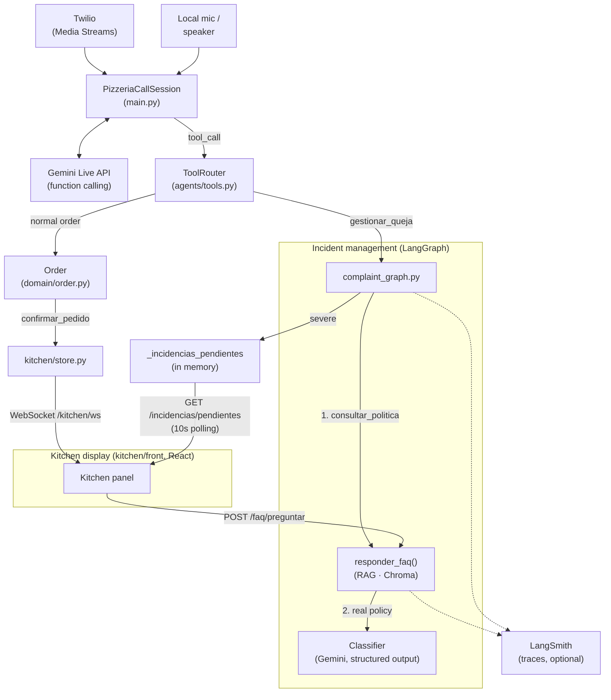

# pizzAI 🍕📞

*[Versión en español](README.md)*

Real-time voice agent that answers phone calls and takes pizza orders,
built on Gemini's Live API with function calling.

## What the conversation does

1. Greets the caller without waiting for them to speak first.
2. Takes pizzas (name + size, using `consultar_menu` if asked about prices
   or ingredients). Several units of the same pizza can be ordered at
   once, an item already added can be removed, or its pizza/size/quantity
   changed without having to remove and re-add it.
3. Asks whether it's for **pickup** or **delivery**:
   - Always asks for the customer's **name**.
   - If delivery, also asks for the **address** (street + number).
4. At the end, regardless of delivery type, asks for a **phone number** (9 digits).
5. Summarizes the full order and asks **once** whether everything is
   correct — it doesn't repeat the question or re-read the summary if the
   customer already said yes.
6. Once confirmed, the order is **closed**: nothing can be added, removed,
   or changed anymore. If the customer asks for something after that,
   they're told the order is already closed.
7. After confirming, it says goodbye and hangs up the call on its own
   (`finalizar_llamada`).

Call robustness, not just the happy path:
- **Silence before confirming**: after 20s it asks if the customer is
  still there; after 45s it hangs up if there's no response.
- **Silence after confirming**: there's no point asking "are you still
  there?" once nothing is left pending — it says goodbye and hangs up
  after 8s; if there's still no reaction, it just cuts the call at 20s.
- **Interruptions (barge-in)**: if the customer speaks while the bot is
  still talking, the response is cut off and the new input is heard.
- **Network drops**: if Gemini disconnects mid-call, it reconnects on its
  own without losing the order in progress (retries with backoff).
- **item_id is never spoken aloud**: it's an internal detail so the model
  can refer to a specific item when removing/modifying something — it
  won't reveal it even if asked directly.

All these silence timers are configurable via `.env` (see
`.env.example`) — lower them if you want to test without waiting real
minutes.

## Architecture



The voice agent (`main.py` + `agents/tools.py` + `domain/`) is raw Gemini
Live via `google-genai` — it doesn't go through LangChain, so it won't
show up in LangSmith even if enabled; it's still observed through
structured logs (`logging_config.py`). Only what runs on LangChain
runnables (RAG and the incident graph) gets traced — see
[Observability](#observability-langsmith) below.

- **`audio/`** — two implementations of the same interface (`AudioIO` in
  `protocol.py`): `LocalAudioIO` (mic/speaker) and `TwilioAudioIO` (a real
  call via Media Streams, with `codecs.py` converting Twilio's 8kHz
  mu-law to the PCM16 16/24kHz Gemini expects). `PizzeriaCallSession`
  neither knows nor cares which one is in use.
- **`main.py`** — `PizzeriaCallSession` keeps the streaming session with
  Gemini Live alive: forwards audio in both directions and receives a
  `tool_call` every time the model decides to act on the order.
- **`agents/`** — `ToolRouter` translates each `tool_call` into an `Order`
  method and returns the result (or the business error) for Gemini to
  read and continue the conversation.
- **`domain/`** — the order's business rules (Pydantic). Knows nothing
  about Gemini, audio, or telephony. 100% testable without mocks.
- **`server.py`** — only comes into play for real calls: FastAPI receives
  Twilio's webhook (`POST /voice/incoming`, validates its signature and
  returns TwiML) and the Media Stream (`WebSocket /media-stream`); each
  call creates a fresh `TwilioAudioIO` + `ToolRouter`, so every order
  stays isolated. It's not involved in the local CLI (`main.py: run()`) —
  audio goes straight to `LocalAudioIO`.

A real consequence of this design: telephony's 8kHz mu-law cuts off
everything above ~4kHz, so the model understands names/addresses/phone
numbers worse on a real call than locally — that's why the
`SYSTEM_PROMPT` requires repeating that data out loud before saving it.
And when the Gemini session ends (the model hangs up, or the idle
watchdog cuts it), `server.py` closes the WebSocket itself — otherwise
Twilio has no way of knowing it should hang up the real call.

## Incident/complaint management (agents/complaint_graph.py)

If the customer calls to report a problem with a **previous order**
(arrived late, cold, incomplete, wrong charge...), the model uses the
`gestionar_queja` tool instead of taking a new order — that call is
exclusively for the incident. Under the hood it's a
[LangGraph](https://langchain-ai.github.io/langgraph/) graph with two
real LLM steps that hand off work to each other:

1. **FAQ step** (`consultar_politica`): reuses
   `rag.faq_chain.responder_faq()` as-is to ask for the real applicable
   policy (e.g. "what's the compensation policy for a delayed delivery?")
   — never makes up a compensation in the prompt.
2. **Complaint classifier** (`clasificar_gravedad`): given the complaint
   and that real policy as context, classifies the incident as
   `minor`/`severe` (structured output) and decides whether to resolve it
   on the spot (compensation code) or escalate it for human review (in
   memory, `pizzeria_bot.agents.complaint_graph.listar_incidencias_pendientes()`).

Escalated incidents show up live on the kitchen display
(`GET /incidencias/pendientes`, a separate panel in `kitchen/front/`, via
10s polling — not WebSocket: `gestionar_queja` runs on a separate thread,
see below, so a live push from there would cross threads for no real
benefit).

There's no "supervisor" node in the graph: the voice agent itself
(Gemini Live) already decides, via function calling, whether a call is an
incident or a normal order — adding a supervisor here would duplicate
that routing.

Needs the `rag` and `complaints` extras installed
(`pip install -e ".[rag,complaints]"` if you're only using the local CLI
without a server) — with a lazy import **in `agents/tools.py`**, so the
base voice bot (normal orders) keeps working exactly the same without
them, and only fails if this tool is actually invoked without them. Note:
this does NOT apply to `server.py`, which imports `agents.complaint_graph`
and `rag.faq_chain` normally (not lazily) to always expose
`/incidencias/pendientes` and `/faq/preguntar` — that's why the `twilio`
extra already pulls in `rag` and `complaints` automatically (see
`pyproject.toml`); if you're spinning up the server, there's nothing
extra to install.
`gestionar_queja` takes several seconds (RAG + classifier LLM) — it runs
on a separate thread (`asyncio.to_thread`, see `main.py`) so it doesn't
freeze the rest of the call (mic, speaker, silence watchdog) while it
waits. Tests in `tests/test_complaint_graph.py` (FAQ and classifier LLM
mocked, no real calls to Gemini).

## Observability (LangSmith)

[LangSmith](https://smith.langchain.com) traces the two parts of the
system that run on LangChain: the RAG chain (`rag/faq_chain.py`) and the
incident graph (`agents/complaint_graph.py`). That's exactly where it's
needed most: that's where an LLM makes a non-deterministic decision
(which policy applies? is it "minor" or "severe"?), and where the
hardest-to-debug real bugs came from when relying only on text logs —
seeing a full trace of the graph (policy consulted → classification →
branch taken) makes visible in the LangSmith UI what used to require
reconstructing from logs by hand.

**What it does NOT cover:** the main voice agent (`main.py`, raw Gemini
Live via `google-genai`) doesn't go through any LangChain runnable, so it
won't show up here — it's still observed through its structured logs
(`logging_config.py`), which is where `tool_call`s, nudges, and the
silence watchdog show up.

Enabling it (optional, nothing needs it to work):

```bash
uv pip install -e ".[rag]"   # already brings langsmith as a dependency
```

```bash
# .env
LANGSMITH_TRACING=true
LANGSMITH_API_KEY=your_langsmith_api_key_here   # smith.langchain.com -> Settings -> API Keys
LANGSMITH_PROJECT=pizzai                          # optional, defaults to "pizzai"
```

Without `LANGSMITH_TRACING=true`, everything works exactly as before —
it's purely additive (see `config.py`).

## Known limitations / next steps

This project is built for portfolio purposes, not as a production
system — these are deliberate scope cuts, not oversights:

- **In-memory state**: confirmed orders, pending incidents, and the
  ticket index (`kitchen/store.py`, `agents/complaint_graph.py`) live in
  process variables — lost on restart. No database.
- **Single process**: no support for multiple replicas sharing that state
  (would need to move state to something external like Redis/Postgres).
- **No rate limiting** on public endpoints beyond Twilio signature
  validation (`X-Twilio-Signature`) — nothing stops, for example,
  flooding `POST /faq/preguntar` with requests.
- **Limited retries**: Gemini Live does reconnect on its own if it drops
  mid-call (see `main.py`), but there's no fallback if Gemini or Twilio
  fail persistently (e.g. rerouting to a human or voicemail).
- **Plain-text logs** (`logging_config.py`), meant to be read locally
  during development — not the structured JSON format a real
  observability stack (Datadog, ELK...) would expect.

## Installation

### Requirement: PortAudio (Windows only, only for the local CLI)

The local CLI (`pizzai`, mic/speaker) uses PyAudioWPatch, which is
Windows-only — there's currently no cross-platform path for this mode. On
Windows you don't need to do anything extra, `pip` ships a wheel with
PortAudio already included.

On Mac/Linux you don't need to install PortAudio: the real telephony
server (`server.py`, via Twilio) and the tests don't depend on any local
microphone/speaker, so they run the same without it.

### Installing the project

- `audio-windows` (PyAudioWPatch) only exists on Windows and is only
  needed if you're going to run the call with a local mic/speaker
  (`LocalAudioIO`).
- `twilio` (FastAPI, uvicorn, `audioop-lts`) is needed for the real
  telephony server (`server.py`). Cross-platform.
- On Linux/macOS, or if you only want to run the domain tests, `dev` is
  enough.

With [`uv`](https://docs.astral.sh/uv/) (recommended):
```bash
# Windows, to run the bot with a local mic/speaker:
uv venv
uv pip install -e ".[dev,audio-windows]"

# Real telephony server with Twilio (any platform):
uv venv
uv pip install -e ".[dev,twilio]"

# Just domain tests/development:
uv venv
uv pip install -e ".[dev]"
```

Or with plain pip:
```bash
python -m venv .venv
# Windows: .venv\Scripts\activate
# Mac/Linux: source .venv/bin/activate
pip install -e ".[dev,audio-windows]"   # Windows with local audio
pip install -e ".[dev,twilio]"          # Twilio server
pip install -e ".[dev]"                 # other platforms / tests only
```

### Configuring

```bash
cp .env.example .env
# edit .env and set your GEMINI_API_KEY
```

If you're using the local CLI on Windows and want to force a specific
mic/speaker (`INPUT_DEVICE_NAME`, `OUTPUT_DEVICE_NAME` in `.env`), first
check what exact name your system uses:
```bash
python scripts/list_audio_devices.py
```

## Running it

```bash
pizzai
```

(or `python -m pizzeria_bot.main`)

Talk as if you were calling the pizzeria. Stop with `Ctrl+C`.

## Real telephony (Twilio)

Receives real calls on your phone and connects them to Gemini, without
touching anything in `domain/` or `agents/` — only where audio comes
from/goes to changes (see [Architecture](#architecture)).

**Security:** both endpoints (`/voice/incoming` and `/media-stream`)
validate the `X-Twilio-Signature` header before processing anything —
without this, anyone who found your public URL could simulate fake calls
and burn through your Gemini quota. The server rejects any request
without a valid signature with `403`, and won't even start if
`TWILIO_AUTH_TOKEN` is missing from `.env` (Twilio console → Account →
Auth Token).

### 1. Start the server

```bash
uv pip install -e ".[dev,twilio]"
uvicorn pizzeria_bot.server:app --host 0.0.0.0 --port 8000
```

### 2. Expose it to the internet

Twilio needs a public HTTPS URL. With
[devtunnel](https://learn.microsoft.com/azure/developer/dev-tunnels/) (Windows, no antivirus surprises):

```bash
devtunnel user login          # once
devtunnel host -p 8000 --allow-anonymous
```

Or with [ngrok](https://ngrok.com/) (cross-platform, free account):

```bash
ngrok config add-authtoken YOUR_TOKEN_HERE   # once
ngrok http 8000
```

Copy the public URL either one gives you. Installation, version,
antivirus, or tunnel-rewriting-headers issues →
[docs/TROUBLESHOOTING.md](docs/TROUBLESHOOTING.md).

### 3. Configure the number in Twilio

In the [Twilio console](https://console.twilio.com/) → **Phone Numbers
→ Manage → Active numbers** → your number → **Voice Configuration → A
call comes in** → Webhook: your public URL + `/voice/incoming`, method
`HTTP POST` → Save.

### 4. Try it

**You call the Twilio number** — with a trial account, only from numbers
verified in the console (usually your own phone).

> ⚠️ If your Twilio number isn't from your country, this might be an
> **international** call for your carrier — check the rate before
> calling.

**Or have Twilio call you** (recommended, cheaper — needs
`TWILIO_ACCOUNT_SID` and `TWILIO_PHONE_NUMBER` in `.env`):

```bash
pizzai-call +1YOUR_NUMBER https://your-public-url
```

> ⚠️ The cost comes out of your Twilio balance, not your carrier: roughly
> **$0.0486/minute** to a Spanish mobile
> ([official rates](https://www.twilio.com/en-us/voice/pricing/es)) —
> check Twilio's pricing page for your target country. Receiving the call
> on your phone is free. If Twilio rejects the call due to international
> permissions (error 21215), the fix is in
> [docs/TROUBLESHOOTING.md](docs/TROUBLESHOOTING.md).

You'll see every incoming call in the server logs with the same format
(`Modelo: ...`, `Usuario: ...`, `tool_call ...`) as in local mode — it's
literally the same `PizzeriaCallSession` underneath.

## Tests

```bash
pytest -v
```

`domain/` and `agents/` tests run without needing PortAudio or a real API
key — they're pure logic tests. `audio/codecs.py` and `audio/twilio_io.py`
tests don't need a real connection to Twilio or Gemini either (they use a
fake in-memory WebSocket). `server.py` tests (including signature
validation) use FastAPI's `TestClient` and generate valid Twilio
signatures by replicating the public algorithm (HMAC-SHA1), without
needing a real account or credentials. `outbound_call.py` tests only
check parameter construction (`build_call_params`) — they never trigger a
real call or spend Twilio balance.

## Docker

Spins up the real telephony server (`server.py`), not the local CLI —
audio from a real call arrives via WebSocket (Twilio), not
mic/speaker, so there's no need to forward hardware into the container.

```bash
docker build -t pizzai -f docker/Dockerfile .
docker run --env-file .env -p 8000:8000 pizzai
```

Expose port 8000 with ngrok (`ngrok http 8000`) just like locally — see
the [Real telephony (Twilio)](#real-telephony-twilio) section.

## License

Code published for portfolio purposes only. All rights reserved — see
[LICENSE](LICENSE). Its use, copying, or modification is not authorized
without the author's express permission.
